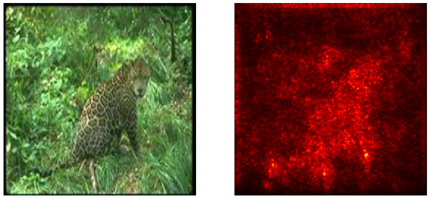
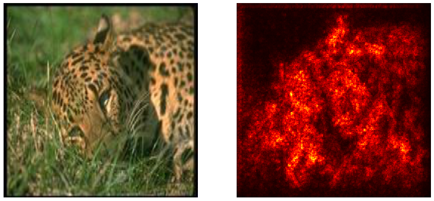

# StableNet

Unofficial implement of [Deep Stable Learning for Out-Of-Distribution Generalization](https://arxiv.org/pdf/2104.07876.pdf).

## Example

Use the caltech101 dataset,  And the saliency maps shows that StableNet does removes irrelevant feature information.

|      Model      |                Saliency maps                 |
| :-------------: | :------------------------------------------: |
|    resnet18     |       |
| resnet18_stable |  |
|    resnet18     |       |
| resnet18_stable |  |
|    resnet18     |         |
| resnet18_stable |    |

